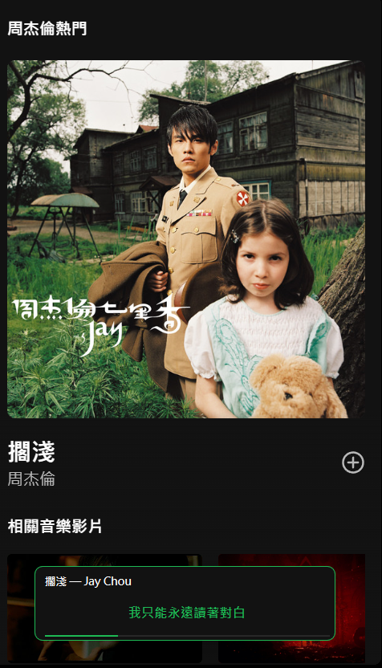

# Spotify Lyrics Widget

A floating, always-on-top desktop widget that shows time-synced Spotify lyrics on Windows.

  

**English** · [繁體中文](#繁體中文) · [简体中文](#简体中文)

---

## English

A small frameless window that floats over your desktop and shows the current Spotify track's synced lyrics, line by line, in time with playback.

### Features

- Time-synced lyrics that follow playback
- Always-on-top, frameless, draggable overlay
- Lyrics from [LRCLIB](https://lrclib.net) with a NetEase fallback
- Multiple size presets; English / 繁體中文 interface
- System-tray control; remembers its on-screen position
- Shows a ♪ during intros and gaps, so you can tell "still fetching" from "loaded, no line yet"

### Download & install

1. Download **[SpotifyLyricsWidgetSetup.exe](https://github.com/5401754017/Spotify-Lyrics-Widget/releases/latest)** from the latest release.
2. Run the installer, choose a language, and finish.
3. Launch **Spotify Lyrics Widget** (`SpotifyLyricsWidget.exe`) from the Start Menu or desktop shortcut.

### First-time Spotify setup

This tool uses your own Spotify App Client ID (free, no `client_secret` needed).

1. In the setup window, click **Open Dashboard**, log in to Spotify, and click **Create App**.
2. Fill in the app:
   - **App name / description**: anything
   - **Redirect URI**: `http://127.0.0.1:8888/callback` (click **Add**)
   - **API**: check **Web API**
   - Accept the terms and click **Save**
3. Open the app's **Settings** and copy the **Client ID**.
4. Back in the tool, paste the Client ID, click **Connect Spotify**, then **Agree** in the browser.

### Data & logs

Settings and logs are stored in `%APPDATA%\spotify-lyrics-widget`. Re-running a newer installer keeps your existing token and settings.

### Troubleshooting

- **invalid redirect URI** — make sure the Dashboard Redirect URI is exactly `http://127.0.0.1:8888/callback`.
- **App not responding** — check `%APPDATA%\spotify-lyrics-widget\widget.log`.

---

## 繁體中文

一個浮在桌面上、永遠置頂的無邊框小視窗，逐行顯示目前 Spotify 播放歌曲的同步歌詞，跟著播放進度走。

### 功能

- 隨播放進度同步捲動的歌詞
- 永遠置頂、無邊框、可拖曳的浮層
- 歌詞來源 [LRCLIB](https://lrclib.net)，找不到時退回 NetEase
- 多種尺寸；介面支援 English / 繁體中文
- 系統匣控制；記住視窗位置
- 前奏與歌詞空檔顯示 ♪，區分「還在抓歌詞」與「歌詞已載入只是還沒唱」

### 下載安裝

1. 到最新 release 下載 **[SpotifyLyricsWidgetSetup.exe](https://github.com/5401754017/Spotify-Lyrics-Widget/releases/latest)**。
2. 執行安裝程式，選擇語言並完成安裝。
3. 從開始選單或桌面捷徑開啟 **Spotify Lyrics Widget**。

### 第一次 Spotify 設定

這個工具需要你自己的 Spotify App Client ID（免費，不需要 `client_secret`）。

1. 在設定視窗按 **開啟 Dashboard**，登入 Spotify 後按 **Create App**。
2. 填寫 App 資料：
   - **App name / description**：隨便填
   - **Redirect URI**：`http://127.0.0.1:8888/callback`（按 **Add**）
   - **API**：勾選 **Web API**
   - 同意條款後按 **Save**
3. 進入 app 的 **Settings**，複製 **Client ID**。
4. 回到工具貼上 Client ID，按 **連接 Spotify**，再到瀏覽器按 **Agree**。

### 資料與 log

設定和 log 放在 `%APPDATA%\spotify-lyrics-widget`。用新版 installer 更新時，原本的 token 和設定會保留。

### 常見問題

- **invalid redirect URI** — 確認 Dashboard 的 Redirect URI 完全等於 `http://127.0.0.1:8888/callback`。
- **App 沒反應** — 查看 `%APPDATA%\spotify-lyrics-widget\widget.log`。

---

## 简体中文

一个浮在桌面上、始终置顶的无边框小窗口，逐行显示当前 Spotify 播放歌曲的同步歌词，跟着播放进度走。

### 功能

- 随播放进度同步滚动的歌词
- 始终置顶、无边框、可拖动的浮层
- 歌词来源 [LRCLIB](https://lrclib.net)，找不到时回退到网易云
- 多种尺寸；界面支持 English / 繁體中文
- 系统托盘控制；记住窗口位置
- 前奏与歌词空档显示 ♪，区分「还在抓歌词」与「歌词已载入只是还没唱」

### 下载安装

1. 到最新 release 下载 **[SpotifyLyricsWidgetSetup.exe](https://github.com/5401754017/Spotify-Lyrics-Widget/releases/latest)**。
2. 运行安装程序，选择语言并完成安装。
3. 从开始菜单或桌面快捷方式打开 **Spotify Lyrics Widget**。

### 第一次 Spotify 设置

这个工具需要你自己的 Spotify App Client ID（免费，不需要 `client_secret`）。

1. 在设置窗口按 **打开 Dashboard**，登录 Spotify 后按 **Create App**。
2. 填写 App 资料：
   - **App name / description**：随便填
   - **Redirect URI**：`http://127.0.0.1:8888/callback`（按 **Add**）
   - **API**：勾选 **Web API**
   - 同意条款后按 **Save**
3. 进入 app 的 **Settings**，复制 **Client ID**。
4. 回到工具粘贴 Client ID，按 **连接 Spotify**，再到浏览器按 **Agree**。

### 数据与日志

设置和日志放在 `%APPDATA%\spotify-lyrics-widget`。用新版 installer 更新时，原本的 token 和设置会保留。

### 常见问题

- **invalid redirect URI** — 确认 Dashboard 的 Redirect URI 完全等于 `http://127.0.0.1:8888/callback`。
- **App 没反应** — 查看 `%APPDATA%\spotify-lyrics-widget\widget.log`。
